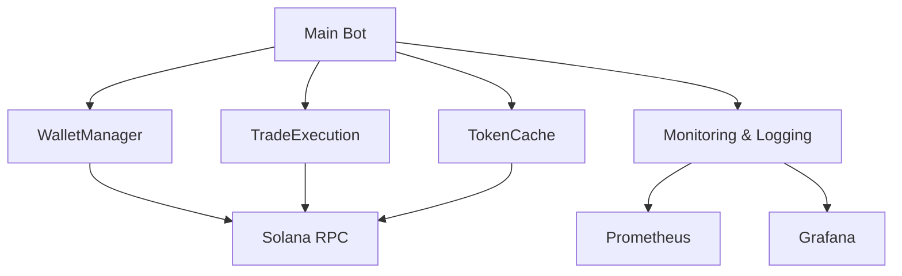

# Solana Trading Bot

## Overview
This bot automates trading on Solana using secure wallet management, transaction confirmation monitoring, and performance optimizations.

## Setup
1. Clone the repository.
2. Install dependencies: `pip install -r requirements.txt`.
3. Set environment variables (e.g., `WALLET_PRIVATE_KEY`, `WALLET_SALT`, `WALLET_PASSWORD`).
4. Run the bot: `python src/main.py`.

## Usage
- The bot supports buy/sell orders, batch processing, and caching for performance.
- Use the `WalletManager` for secure transaction handling and confirmation monitoring.

## Architecture



- **Core Components:**
  - `WalletManager`: Secure wallet and transaction handling.
  - `TradeExecution`: Executes trades with retry logic and confirmation monitoring.
  - `TokenCache`: Caches token data for performance.
- **Testing:**
  - Integration tests use a mock Solana network.
  - Stress tests simulate high-frequency trading and batch processing.

## Contributing
See `CONTRIBUTING.md` for guidelines on code style, PR process, and development setup.

## Troubleshooting
See `troubleshooting.md` for common errors and solutions.

## Performance Tuning
Refer to the performance tuning guide for optimizing bot behavior under load.

## Features

- Real-time token monitoring with WebSocket support
- Automated trading with configurable parameters
- Comprehensive error handling with circuit breakers
- Secure wallet management with encryption
- Performance optimized with caching and connection pooling
- Extensive monitoring and logging
- Docker support with health checks
- High test coverage

## Architecture

```
├── src/
│   ├── main.py              # Main trading bot implementation
│   ├── core/                # Core functionality
│   │   ├── config.py        # Configuration management
│   │   ├── dex.py          # DEX interaction
│   │   ├── error_handler.py # Error handling
│   │   ├── monitoring.py    # Monitoring and logging
│   │   └── wallet.py       # Wallet management
│   ├── tests/              # Test suite
│   └── utils/              # Utility functions
├── config/                 # Configuration files
├── data/                   # Data storage
├── logs/                   # Log files
└── scripts/               # Utility scripts
```

## Prerequisites

- Python 3.9+
- Docker and Docker Compose
- Solana CLI tools
- Sufficient SOL balance for trading

## Configuration

### Core Settings

```yaml
trading:
  min_liquidity: 10000
  max_slippage: 0.02
  min_profit: 0.05
  max_position: 0.1
  min_position: 0.01
  cooldown: 300

monitoring:
  check_interval: 60
  max_retries: 3
  retry_delay: 5

error_handling:
  max_errors: 5
  error_cooldown: 300
```

### Environment Variables

```env
# Core Settings
WALLET_ADDRESS=your_wallet_address
SIMULATION_MODE=false

# Security
WALLET_SALT=your_salt
WALLET_PASSWORD=your_password

# RPC Settings
RPC_URL=https://api.mainnet-beta.solana.com
RPC_COMMITMENT=confirmed

# Monitoring
PROMETHEUS_PORT=8000
GRAFANA_ADMIN_USER=admin
GRAFANA_ADMIN_PASSWORD=your_password
```

## Usage

### Running Locally

1. Start the bot:
```bash
python src/main.py
```

2. Run in simulation mode:
```bash
python src/main.py --simulation
```

### Docker Deployment

1. Build and start services:
```bash
docker-compose up -d
```

2. View logs:
```bash
docker-compose logs -f trading-bot
```

3. Access monitoring:
- Prometheus: http://localhost:9090
- Grafana: http://localhost:3000
- Loki: http://localhost:3100

## Testing

1. Run unit tests:
```bash
pytest
```

2. Run with coverage:
```bash
pytest --cov=src --cov-report=html
```

3. Run integration tests:
```bash
pytest tests/integration/
```

## Monitoring

### Metrics

The bot exposes the following Prometheus metrics:

- `trading_bot_trades_total`: Total trades executed
- `trading_bot_position_size`: Current position sizes
- `trading_bot_token_price`: Token prices
- `trading_bot_liquidity`: Token liquidity
- `trading_bot_errors_total`: Error counts
- `trading_bot_trade_latency_seconds`: Trade execution latency

### Logging

Logs are stored in the `logs` directory with:
- Daily rotation
- 7-day retention
- JSON format for machine processing
- Structured logging with context

## Security

- Encrypted wallet storage
- Secure key management
- Rate limiting
- Input validation
- Error handling
- Circuit breakers

## Error Handling

The bot implements comprehensive error handling:

1. Circuit Breakers:
   - Network errors
   - Transaction failures
   - Wallet issues

2. Retry Logic:
   - Configurable retry attempts
   - Exponential backoff
   - Error categorization

3. Monitoring:
   - Error tracking
   - Alert thresholds
   - Error reporting

## Performance

- WebSocket connections for real-time data
- LRU caching for frequently accessed data
- Connection pooling
- Optimized transaction handling
- Efficient event loops

## License

MIT License

## Support

For support, please:
1. Check the documentation
2. Search existing issues
3. Create a new issue if needed

## Acknowledgments

- Solana Foundation
- Raydium Protocol
- Prometheus
- Grafana
- Loki
